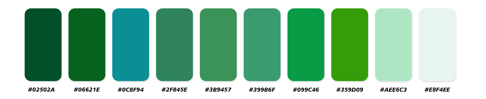
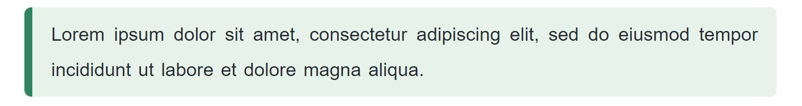

<p align="center">
    一款令人如沐春风的 Typora 灵动主题
    <br/>
    A refreshing and graceful Typora theme, like a gentle spring breeze.
    <br>
    Support custom configuration
    <br>
    支持自定义配置
</p>
<p align="center">
  <a>
    
  </a>
  <a>
    
  </a>
  <a>
    
  </a>
  <a>
    
  </a>
  <a>
      
  </a>
</p>

<p align="center">
    <a href="./README.md">English</a>
    ·
    <a>简体中文</a>
</p>

## 目录

- [主题预览](#主题预览)
- [设计元素](#设计元素)
- [自定义配置](#自定义配置)
    - [交互动画配置](#交互动画配置)
- [快速安装与应用](#快速安装与应用)
- [致谢](#致谢)
- [许可](#许可)

## 主题预览


## 设计元素

### 1. 充满春天气息的配色卡



### 2. 不同效果的灵动交互

- 一级标题 h1

<p align="center">
    
</p>

- 二级标题 h2

<p align="center">
    
</p>

- 三、四、五、六级标题 h3 h4 h5 h6

<p align="left">
    
</p>

- 段落悬停响应

 <p align="center">
    
 </p>

- 内联样式

<p align="left">
    
</p>

- 无序列表

<p align="left">
    
 </p>

- 有序列表

<p align="left">
    
</p>

- 图片

 <p align="center">
    
</p>

- 表格

<p align="center">
    
</p>

- 代码块

<p align="center">
    
</p>

- 引用块

<p align="center">
    
</p>

- 警告框

<p align="center">
    
</p>

### 3. 风格统一的 Typora 界面


## 自定义配置

### 交互动画配置

|         类型         |                      变量名                      |            值            |              功能               |
| :------------------: | :----------------------------------------------: | :----------------------: | :-----------------------------: |
|     **全局配置**     |              `--use-dynamic-effect`              |          0 / 1           | 关闭全部交互动画 / 使用交互动画 |
|       一级标题       |               `--h1-hover-effect`                |          0 / 1           |           开启 / 关闭           |
|       二级标题       |               `--h2-after-effect`                |          0 / 1           |           开启 / 关闭           |
| 三、四、五、六级标题 |              `--h3-6-hover-effect`               |          0 / 1           |           开启 / 关闭           |
|         段落         |                `--p-hover-effect`                |          0 / 1           |           开启 / 关闭           |
|         图片         |               `--img-hover-effect`               |          0 / 1           |           开启 / 关闭           |
|        引用块        |           `--blockquote-hover-effect`            |          0 / 1           |           开启 / 关闭           |
|        提示框        |              `--alert-hover-effect`              |          0 / 1           |           开启 / 关闭           |
|         粗体         |             `--strong-hover-effect`              |          0 / 1           |           开启 / 关闭           |
|         斜体         |               `--em-hover-effect`                |          0 / 1           |           开启 / 关闭           |
|        下划线        |                `--u-hover-effect`                |          0 / 1           |           开启 / 关闭           |
|         高亮         |              `--mark-hover-effect`               |          0 / 1           |           开启 / 关闭           |
|        删除线        |               `--del-hover-effect`               |          0 / 1           |           开启 / 关闭           |
|      内联代码块      |              `--code-hover-effect`               |          0 / 1           |           开启 / 关闭           |
|        代码块        |              `--fence-hover-effect`              |          0 / 1           |           开启 / 关闭           |
|         列表         | `--list-marker-effect`<br>`--list-ol-text-style` | 0 / 1<br>nornal / italic |   开启 / 关闭<br>正体 / 斜体    |
|        分割线        |               ` --hr-hover-effect`               |          0 / 1           |           开启 / 关闭           |
|         表格         |              `--table-hover-effect`              |          0 / 1           |           开启 / 关闭           |

## 项目进展

- [x] 浅色主题 SprIng
- [x] 灵动交互
- [x] 交互动画配置
- [ ] HTML导出配置
- [ ] 文档排版配置
- [ ] 暗色主题 SprIngNight
- [ ] 自定义配色卡
- [ ] 自定义样式
- [ ] [typora-plugin](https://github.com/obgnail/typora_plugin) 统一风格适配 

## 快速安装与应用

1. 在终端使用以下命令将此仓库克隆到本地 **/** 或者您也可以从 [Releases](https://github.com/SprInec/typora-spring-theme/releases) 获取稳定版本的压缩包并解压到本地。

    ```bash
    git clone https://github.com/SprInec/typora-spring-theme.git
    ```

2. 在 Typora 的左上角菜单中点击 ‘主题’，在 ‘主题’ 页面中点击打开 ‘主题文件夹’ 按钮。
3. 将文件 `spring.css` 复制到打开的 Typora 主题文件夹中。
4. 重启 Typora，然后主题列表中就可以选择使用 **Spring** 主题啦。

## [致谢](credits.md)

本项目基于 *typora-mo-theme* 进行了视觉与交互设计的二次开发，[template](template/) 来源于 *typora-theme-Jinxiu/template*。

- [MarMomento/typora-mo-theme](https://github.com/MarMomento/typora-mo-theme)
- [Sophomoresty/typora-theme-Jinxiu](https://github.com/Sophomoresty/typora-theme-Jinxiu)

## 许可

 该项目基于 MIT 开源协议，您可以自由地复制、修改和分发本项目的代码，但请保留原作者的[版权声明](LICENSE)。

