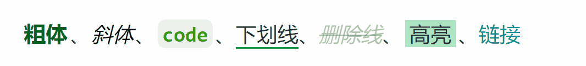
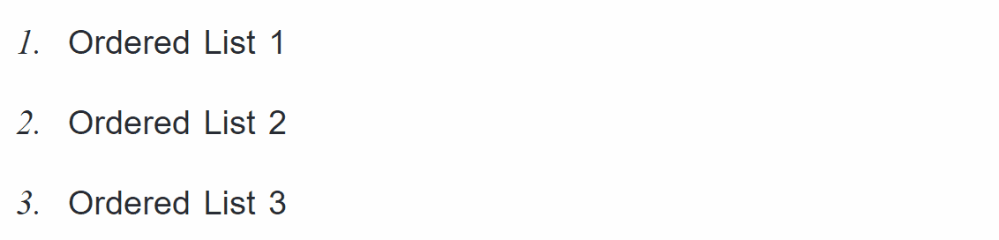

<p align="center">
    一款令人如沐春风的 Typora 灵动主题
    <br/>
    A refreshing and graceful Typora theme, like a gentle spring breeze.
</p>

<p align="center">
  <a>
    
  </a>
  <a>
    
  </a>
  <a>
    
  </a>
  <a>
    
  </a>
  <a>
    
  </a>
</p>

<p align="center">
    <a href="./README.md">English</a>
    ·
    <a>简体中文</a>
</p>
## 目录

- [主题预览](#主题预览)
- [设计元素](#设计元素)
- [快速安装与应用](#快速安装与应用)
- [致谢](#致谢)
- [许可](#许可)

## 主题预览


## 设计元素

##### 1. 充满春天气息的配色卡


##### 2. 不同效果的灵动交互

- 一级标题 h1

<p align="center">
    
</p>

- 二级标题 h2

<p align="center">
    
</p>

- 三、四、五、六级标题 h3 h4 h5 h6

<p align="left">
    
</p>

- 段落悬停响应

 <p align="center">
    
 </p>

- 内联样式

<p align="left">
    
</p>

- 无序列表

<p align="left">
    
 </p>

- 有序列表

<p align="left">
    
</p>

- 图片

 <p align="center">
    
</p>

- 表格

<p align="center">
    
</p>

- 代码块

<p align="center">
    
</p>

- 引用块

<p align="center">
    
</p>

- 警告框

<p align="center">
    
</p>

##### 3. 风格统一的 Typora 界面


## 快速安装与应用

1. 将此仓库克隆到本地。

    ```bash
    git clone https://github.com/SprInec/typora-spring-theme.git
    ```

2. 在 Typora 的左上角菜单中点击 ‘主题’，在 ‘主题’ 页面中点击打开 ‘主题文件夹’ 按钮。
3. 将文件 `spring.css` 复制到打开的 Typora 主题文件夹中。
4. 重启 Typora，然后主题列表中就可以选择使用 **Spring** 主题啦。

## [致谢](credits.md)

本项目基于 *typora-mo-theme* 进行了视觉与交互设计的二次开发，[template](template/) 来源于 *typora-theme-Jinxiu/template*。

- [MarMomento/typora-mo-theme](https://github.com/MarMomento/typora-mo-theme)
- [Sophomoresty/typora-theme-Jinxiu](https://github.com/Sophomoresty/typora-theme-Jinxiu)

## 许可

 该项目基于 MIT 开源协议，您可以自由地复制、修改和分发本项目的代码，但请保留原作者的[版权声明](LICENSE)。

